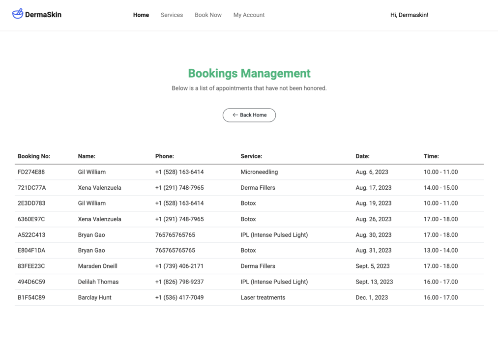

# DermaSkin #

* This is my Project Portofolio 4 for Code Institue Diploma in Software Development - E-commerce Applications. The project is a website for a derma clinic. The idea was to present the user with information about services that are offered by the business and explain more about them. If the user decides to use the services of the clinic, the booking page offers that possibility.
The users can create an account and save/update their contact information. The profile page offers a booking history as well. As a business owner, he can add services through the front-end, view all the future bookings and details, and can manage the products with a click of a button.

The live version of the website is available for you here : <a href="https://dermaskin-pp4-37d6c98e9c3c.herokuapp.com/">DermaSkin</a>

# README CONTENTS # 

* ## [UX](#ux-1)
   * [User Stories](#user-stories)
   * [Agile Methodologies](#agile-methodologies)
   * [The Scope](#1-scope)
   * [Structure](#2-structure)
   * [Skeleton](#3-skeleton)
   * [Surface](#4-surface)

* ## [Features](#features)
    * [Home Page](#home-page)
    * [Navigation Menu](#navigation-menu)
    * [User Registration and Login](#user-registration-and-login)
    * [Services](#services)
    * [Service Detail](#service-detail)
    * [Booking service](#booking-service)
    * [Profile Page](#profile-page)
    * [Booking management](#booking-management)

* ## [Deployment](#deployment)
    * [Heroku Service](#herokucom-service)
    * [Final Steps](#final-steps)

* ## [Technologies Used]()
    * [Languages Used](#languages)
    * [Frameworks / Libraries](#frameworks-libraries)

* ## [Credits](#credits-1)
* ## [User Stories](#user-stories-table)

# UX #

## User Stories ##

  * As the site owner I want: 
  
    * A simple and intuitive user interface that is easy to navigate.
    * The ability to manage user accounts and access.
    * The ability to manage the services offered.
    * The ability to receive bookings for services.
    * A responsive design that works well on any device.
    * The ability for the users to update personal detail and view booking history.

  * As the user, I would want: 

    * A responsive and user-friendly design that works well on any device
    * An easy and efficient way to browse through pages of the website.
    * The ability to create an account and see my appointments.
    * The possibility to save my data for future bookings.
    * The ability to book a service if I want.

    

## Agile Methodologies ##

The agile methodology approach was used here when creating DermaSkin website. Instead of Kanban Board I decided (as I was working alone and not in a team) to use the Google Spreadsheet attached at the bottom of the readme file and cross task one by one from the list in order to work on each user story.

The MoSCoW principle was used when created the UserStories: 
- Must have
- Should have
- Could have

The application will have more features added in the future with constant progression towards a fully completed application.

## 1. Scope ## 

The website aims to provide a platform for existing customers, and attract new customers for the business. Users will be able to register an account, save their data for future appointments, browse through services offered, book a service, and view a list of their bookings. The website is simple to use, with a focus on providing a visually appealing and responsive design.

## 2. Structure ##

* Home Page - a landing page that provides an overview of the business and its services.
* Register Page - a page where users can create a new account by providing their name, email address and a password.
* Login Page - a page where users can log in to their account using their email address and password.
* User Profile Page - a page where users can update their personal information and view a list of their appointments.
* Service Page -  a page where users can view all the services offered.
* Service Detail Page - a page where the user can see a detailed view of the service.
* Bookings Page - a page where the user can create an appointment for any service offered by the business.
* Add Service Page - a page where the admin/owner can add a new service on the website.
* Edit Service Page - a page where the admin/owner can edit a service on the website.
* Booking Management Page - a page where the admin/owner can see all the future appointments and customer details.

## 3. Skeleton ##

Here is a basic wireframe of the website's layout : 

Here is the database schema for the project : 

## 4. Surface ## 

The design of DermaSkin is clean and modern, with a focus on readability and ease of use. The color scheme consists primarily of white and blue, with green accents used sparingly for emphasis.

### Layout -

The layout of DermaSkin is responsive and adapts well to different screen sizes. Bootstrap and Bootstrap Studio used in order to provide a responsive website. The navbar is fixed at the top of the screen and is always visible, with the site logo, navigation links centered and spread between.
The Hero section uses a large background image, with a centered heading and subheading along with two buttons for Services page and Booking page.
Cards are used throughout the site to display content, such as services, information about business, information about individual service and forms.
The footer is fixed always to the bottom of the screen containing the contact details, navigation links, social media links and logo.

# Features #

## Navigation:
- A menu at the top of the page allows users to easily navigate between different pages on the site.

## Home Page:
 - The Home page contains information about the services offered and skin problems that the user could face.
 
## User registration and login:
- Users can create an account to access member-only features and log in to access their account in the future.

## Services:
 - AAll services are visible on the services page.
 

- For the Admin/Owner on services page and detail page, edit, delete buttons are visible.

## Service Detail:
 - Each service has an individual page with important information, explanations, prices and FAQ.
 
## Booking service:
- Users can book a service on the booking page and submiting the form a success page is shown.
 
## Profile Page:
- Users can update their information on profile page and can see a history of bookings.
 
## Booking management:
- Admin/owner can have a complete view of future bookings, filtered automatically by date.
 
- Admin/owner can add a new service anytime using the Add Service page.

# Testing # 

 * I have created a seperate markdown documentation for the testing of this project. 

 - You can view the testing here : [Testing.MD](./TESTING.md)

 

# Deployment #

* ## Heroku.com Service ##

  * Here we log in or create an account to begin with.
  * On the dashboard view click 'Create New App' from the dropdown menu
  * Choose your app-name and region
  * Setup the CONFIG_VARS in the Settings tab in your project. 
      * SECRET_KEY
      * DATABASE_URL
      * CLOUDINARY_URL

      These three url's are to be set up and configured in your project.
      These connect your Database , Cloudinary and your Django Enviroment Key.
  * In the buildpack section in the settings tab add Python , then save changes.
  * Last but not least Link your project under the Deploy tab by selecting it from your github repository.

* ## Final Steps #

  * Make sure your settings.py option DEBUG = True is set to FALSE.
  * Ensure you have your Procfile created with the following code :
      * web: gunicorn carstyleautos.wsgi

* You can find the deployed version of the website here : <a href="https://dermaskin-pp4-37d6c98e9c3c.herokuapp.com/" target="_blank">DermaSkin</a>

# Technologies Used #

* ## Languages ##
  * HTML
  * CSS
  * Python
  * JavaScript

* ## Frameworks / Libraries / Programs ##
  * <a href="https://www.djangoproject.com/">Django (Python web Framework)</a> 
  * <a href="https://jquery.com/">jQuery (Javascript Library)</a>
  * <a href="https://getbootstrap.com/">Bootstrap (Front-End Library)</a>
  * <a href="https://django-crispy-forms.readthedocs.io/en/latest/">Django-Crispy-Forms (Django Form Rendering Library)</a>
  * <a href="https://pypi.org/project/psycopg2/">Psycopg2-Binary(PostgreSQL database adapter for Python)</a>
  * <a href="https://github.com/">GitHub (Version Control alongside a Local Development Enviroment)</a>
  * <a href="https://icons8.com/">Icon8 (Library of Icons)</a>
  * <a href="https://www.elephantsql.com/">ElephantSQL (Hosting service for the database for this application)</a>
  * <a href="https://cloudinary.com/?&utm_campaign=1329&utm_content=instapagelogocta-selfservetest">Cloudinary (Cloud based storage for all media files)</a>
  * <a href="https://heroku.com/">Heroku (Application hosting service)</a>
  * <a href="https://bootstrapstudio.io/">Bootstrap Studio</a>

# Credits #

### Coding ###

* All the resources below, were extremly helpful in creating the project. Whenever I needed help stackoverflow and Code Institute walkthrough projects help immensily.

* <a href="https://google.com">Google</a>
* <a href="https://ui.dev/amiresponsive">AMI Responsive</a>
* <a href="https://stackoverflow.com/">Stack Overflow</a>
* <a href="https://freepik.com/">FreePik</a>
* <a href="https://icons8.com">Icon8</a>
* <a href="https://https://codeinstitute.net/">Code Institute</a>
* <a href="https://getbootstrap.com/docs/5.3/getting-started/introduction/">Boostrap Documentations</a>
* <a href="https://bootstrapstudio.io/">Boostrap Studio</a>

* All my images were sourced from FreePik, and any copyrights are reserved for the owners as these are just for display purposes only.

* Of course, without Code Institute providing the necessary guidance, this project could not exist. And Student Care for providing support when needed the most.

[def]: #credits

# User Stories Table #

User Stories

<meta http-equiv="Content-Type" content="text/html; charset=utf-8">
<link type="text/css" rel="stylesheet" href="resources/sheet.css">

    <table class="waffle" cellspacing="0" cellpadding="0">
        <thead>
            <tr>
                <th class="row-header freezebar-origin-ltr"></th>
                <th id="0C0" style="width:507px;" class="column-headers-background">A</th>
                <th id="0C1" style="width:100px;" class="column-headers-background">B</th>
                <th id="0C2" style="width:246px;" class="column-headers-background">C</th>
                <th id="0C3" style="width:593px;" class="column-headers-background">D</th>
            </tr>
        </thead>
        <tbody>
            <tr style="height: 20px">
                <th id="0R0" style="height: 20px;" class="row-headers-background">
                    
1

                </th>
                <td class="s0">USER STORY</td>
                <td class="s1">MoSCoW</td>
                <td class="s2">Acceptance Criteria</td>
                <td class="s2">TASKS</td>
            </tr>
            <tr style="height: 20px">
                <th id="0R1" style="height: 20px;" class="row-headers-background">
                    
2

                </th>
                <td class="s3" colspan="4">Milestone - Setup</td>
            </tr>
            <tr style="height: 20px">
                <th id="0R2" style="height: 20px;" class="row-headers-background">
                    
3

                </th>
                <td class="s4"></td>
                <td class="s5">must have</td>
                <td class="s4">GitHub repository setup using CI templates</td>
                <td class="s6">Create a GitHub repo using CI Template</td>
            </tr>
            <tr style="height: 20px">
                <th id="0R3" style="height: 20px;" class="row-headers-background">
                    
4

                </th>
                <td class="s4"></td>
                <td class="s5">must have</td>
                <td class="s4">Django install successfully</td>
                <td class="s6">Install Django</td>
            </tr>
            <tr style="height: 20px">
                <th id="0R4" style="height: 20px;" class="row-headers-background">
                    
5

                </th>
                <td class="s4"></td>
                <td class="s5">must have</td>
                <td class="s4">Base template functional</td>
                <td class="s6">Create a base.html file</td>
            </tr>
            <tr style="height: 20px">
                <th id="0R5" style="height: 20px;" class="row-headers-background">
                    
6

                </th>
                <td class="s4"></td>
                <td class="s5">must have</td>
                <td class="s4">Static files working</td>
                <td class="s6">Create static/css folders and base.css</td>
            </tr>
            <tr style="height: 20px">
                <th id="0R6" style="height: 20px;" class="row-headers-background">
                    
7

                </th>
                <td class="s3" colspan="4">Milestone - Navigation</td>
            </tr>
            <tr style="height: 20px">
                <th id="0R7" style="height: 20px;" class="row-headers-background">
                    
8

                </th>
                <td class="s4" rowspan="3">As a site user I want to be able to view the navbar from every page so that I
                    can navigate easily between pages.</td>
                <td class="s5" rowspan="3">must have</td>
                <td class="s4" rowspan="3">implement responsive nav view across all pages implement mobile nav view
                </td>
                <td class="s6">create navigation template</td>
            </tr>
            <tr style="height: 20px">
                <th id="0R8" style="height: 20px;" class="row-headers-background">
                    
9

                </th>
                <td class="s6">make the navigation template available across every page through inclusion in the base
                    template</td>
            </tr>
            <tr style="height: 20px">
                <th id="0R9" style="height: 20px;" class="row-headers-background">
                    
10

                </th>
                <td class="s6">create separate navigation for mobile view</td>
            </tr>
            <tr style="height: 20px">
                <th id="0R10" style="height: 20px;" class="row-headers-background">
                    
11

                </th>
                <td class="s4">As a site user I want to be able to know where I am on the website and navigate through
                    pages quickly</td>
                <td class="s7" dir="ltr">could have</td>
                <td class="s4">implement breadcrumbs for each page</td>
                <td class="s6">create breadcrumbs template with </td>
            </tr>
            <tr style="height: 20px">
                <th id="0R11" style="height: 20px;" class="row-headers-background">
                    
12

                </th>
                <td class="s3" colspan="4">Milestone - Registration and User Profiles</td>
            </tr>
            <tr style="height: 27px">
                <th id="0R12" style="height: 27px;" class="row-headers-background">
                    
13

                </th>
                <td class="s4" dir="ltr" rowspan="3">As a site user I want to be able to easily register for a user
                    account so that I can have an account and be able to view my previous booking details</td>
                <td class="s5" rowspan="3">must have</td>
                <td class="s4" rowspan="3">allauth default Registration/Login allauth default registration forms and
                    templates loading view options to Register or Login to My Account in navbar</td>
                <td class="s6">create profiles app</td>
            </tr>
            <tr style="height: 26px">
                <th id="0R13" style="height: 26px;" class="row-headers-background">
                    
14

                </th>
                <td class="s6">install allauth</td>
            </tr>
            <tr style="height: 33px">
                <th id="0R14" style="height: 33px;" class="row-headers-background">
                    
15

                </th>
                <td class="s6">create dropdown on My Account to see Register/Login links </td>
            </tr>
            <tr style="height: 20px">
                <th id="0R15" style="height: 20px;" class="row-headers-background">
                    
16

                </th>
                <td class="s4" rowspan="3">As a site user I want to be able to login to my account so that I can access,
                    view and edit my personal account information</td>
                <td class="s5" rowspan="3">must have</td>
                <td class="s4" rowspan="3">view options to Register or Login to My Account in navbar new user can
                    create a user account by submitting a form</td>
                <td class="s6">import allauth templates</td>
            </tr>
            <tr style="height: 20px">
                <th id="0R16" style="height: 20px;" class="row-headers-background">
                    
17

                </th>
                <td class="s8">create profile form and template for profile page</td>
            </tr>
            <tr style="height: 33px">
                <th id="0R17" style="height: 33px;" class="row-headers-background">
                    
18

                </th>
                <td class="s6">add messages for error and success actions on allauth</td>
            </tr>
            <tr style="height: 20px">
                <th id="0R18" style="height: 20px;" class="row-headers-background">
                    
19

                </th>
                <td class="s4">As a site user I want to be able to logout of my account so that I can log out and secure
                    my personal account information when not using the store.</td>
                <td class="s5">must have</td>
                <td class="s4">logged in user is able to logout from account</td>
                <td class="s6">logout link should be visible after user login in My Account navbar</td>
            </tr>
            <tr style="height: 30px">
                <th id="0R19" style="height: 30px;" class="row-headers-background">
                    
20

                </th>
                <td class="s4" dir="ltr" rowspan="3">As a logged in user I want to be able to edit my personal details
                    so that I can keep my account profile up to date</td>
                <td class="s9" rowspan="3">should have</td>
                <td class="s4" rowspan="3">access My Account information through from any page edit My Account
                    personal details save changes to My Account personal details</td>
                <td class="s6">create form to view/save changes made to the User&#39;s profile data</td>
            </tr>
            <tr style="height: 29px">
                <th id="0R20" style="height: 29px;" class="row-headers-background">
                    
21

                </th>
                <td class="s4">create view to request the authenticated user&#39;s data and populate the form</td>
            </tr>
            <tr style="height: 31px">
                <th id="0R21" style="height: 31px;" class="row-headers-background">
                    
22

                </th>
                <td class="s10" dir="ltr">add a table with context from user&#39;s previous bookings in template</td>
            </tr>
            <tr style="height: 20px">
                <th id="0R22" style="height: 20px;" class="row-headers-background">
                    
23

                </th>
                <td class="s3" dir="ltr" colspan="4">Milestone - Services</td>
            </tr>
            <tr style="height: 20px">
                <th id="0R23" style="height: 20px;" class="row-headers-background">
                    
24

                </th>
                <td class="s4" dir="ltr" rowspan="4">As a site user I want to be able to view a list of services so that
                    I can select one or more to book..</td>
                <td class="s5" rowspan="4">must have</td>
                <td class="s4" dir="ltr" rowspan="4">all services can be viewed in a responsive grid clicking
                    &#39;book now&#39; button should send the user to booking page</td>
                <td class="s6" dir="ltr">build services App</td>
            </tr>
            <tr style="height: 20px">
                <th id="0R24" style="height: 20px;" class="row-headers-background">
                    
25

                </th>
                <td class="s6" dir="ltr">create services template page</td>
            </tr>
            <tr style="height: 20px">
                <th id="0R25" style="height: 20px;" class="row-headers-background">
                    
26

                </th>
                <td class="s6" dir="ltr">create a loop to render each service individually to services page</td>
            </tr>
            <tr style="height: 20px">
                <th id="0R26" style="height: 20px;" class="row-headers-background">
                    
27

                </th>
                <td class="s6" dir="ltr">render a detail, to allow the user to go to service detail page and/or book the
                    service</td>
            </tr>
            <tr style="height: 20px">
                <th id="0R27" style="height: 20px;" class="row-headers-background">
                    
28

                </th>
                <td class="s4" dir="ltr" rowspan="2">As a site user I want to be able to view similar services so that I
                    can select other services to book.</td>
                <td class="s7" dir="ltr" rowspan="2">could have</td>
                <td class="s4" dir="ltr" rowspan="2">on service detail page display similar services for upsale</td>
                <td class="s6" dir="ltr">create a view to show similar services on service detail page</td>
            </tr>
            <tr style="height: 20px">
                <th id="0R28" style="height: 20px;" class="row-headers-background">
                    
29

                </th>
                <td class="s10" dir="ltr">create a slider for services detail template to showcase similar services</td>
            </tr>
            <tr style="height: 20px">
                <th id="0R29" style="height: 20px;" class="row-headers-background">
                    
30

                </th>
                <td class="s3" dir="ltr" colspan="4">Milestone - Booking</td>
            </tr>
            <tr style="height: 20px">
                <th id="0R30" style="height: 20px;" class="row-headers-background">
                    
31

                </th>
                <td class="s4" dir="ltr" rowspan="4">As a site user I want to be able to book a service so that I can
                    make sure I have an appointment.</td>
                <td class="s5" rowspan="4">must have</td>
                <td class="s4" dir="ltr" rowspan="4">any user can use the &quot;book now&quot; button </td>
                <td class="s6" dir="ltr">create booking app</td>
            </tr>
            <tr style="height: 20px">
                <th id="0R31" style="height: 20px;" class="row-headers-background">
                    
32

                </th>
                <td class="s6" dir="ltr">create booking model and form</td>
            </tr>
            <tr style="height: 20px">
                <th id="0R32" style="height: 20px;" class="row-headers-background">
                    
33

                </th>
                <td class="s6" dir="ltr">create booking view and template</td>
            </tr>
            <tr style="height: 20px">
                <th id="0R33" style="height: 20px;" class="row-headers-background">
                    
34

                </th>
                <td class="s6"></td>
            </tr>
            <tr style="height: 20px">
                <th id="0R34" style="height: 20px;" class="row-headers-background">
                    
35

                </th>
                <td class="s4" dir="ltr" rowspan="3">As a site user I want to be able to view on screen notifications
                    when I make a booking so that I can confirm my action was successful.</td>
                <td class="s5" rowspan="3">must have</td>
                <td class="s4" dir="ltr" rowspan="3">user gets a successful message when the booking was create user
                    can close the message box</td>
                <td class="s6" dir="ltr">create messages for success, error, warning and info</td>
            </tr>
            <tr style="height: 20px">
                <th id="0R35" style="height: 20px;" class="row-headers-background">
                    
36

                </th>
                <td class="s6">add success messages to views</td>
            </tr>
            <tr style="height: 20px">
                <th id="0R36" style="height: 20px;" class="row-headers-background">
                    
37

                </th>
                <td class="s6" dir="ltr">create success template with success message and a preview of the service
                    booked and details</td>
            </tr>
            <tr style="height: 43px">
                <th id="0R37" style="height: 43px;" class="row-headers-background">
                    
38

                </th>
                <td class="s6" dir="ltr">As a site user I want to be able to view the total price of the service so I
                    know how much I should pay for the service booked</td>
                <td class="s11" dir="ltr">could have</td>
                <td class="s6" dir="ltr">users can view the price of the service booked</td>
                <td class="s6" dir="ltr">add price readme field to form</td>
            </tr>
            <tr style="height: 1px">
                <th id="0R38" style="height: 1px;" class="row-headers-background">
                    
39

                </th>
                <td class="s6" dir="ltr"></td>
                <td class="s12"></td>
                <td class="s6" dir="ltr"></td>
                <td class="s6" dir="ltr"></td>
            </tr>
            <tr style="height: 20px">
                <th id="0R39" style="height: 20px;" class="row-headers-background">
                    
40

                </th>
                <td class="s3" colspan="4">Milestone - Store Owner Admin</td>
            </tr>
            <tr style="height: 20px">
                <th id="0R40" style="height: 20px;" class="row-headers-background">
                    
41

                </th>
                <td class="s4" dir="ltr">As the store owner/admin I want to be able to have a access to the website data
                    so that I can view/add/edit services.</td>
                <td class="s5">must have</td>
                <td class="s4">only store owner/admin can access admin page</td>
                <td class="s6">create a superuser and add if statement on Profile link in navbar</td>
            </tr>
            <tr style="height: 20px">
                <th id="0R41" style="height: 20px;" class="row-headers-background">
                    
42

                </th>
                <td class="s4" dir="ltr" rowspan="4">As the store owner/admin I want to be able to add a new service to
                    the site so that I can expand the services offering as needed</td>
                <td class="s5" rowspan="4">must have</td>
                <td class="s4" dir="ltr" rowspan="4">Add Service button in My Account, visible only for superuser Add
                    Service page renders with all fields and on submit is adding the service in database</td>
                <td class="s6" dir="ltr">add link for Add Service template to My Account icon dropdown, visible only if
                    superuser is authenticated</td>
            </tr>
            <tr style="height: 20px">
                <th id="0R42" style="height: 20px;" class="row-headers-background">
                    
43

                </th>
                <td class="s6" dir="ltr">render Add Service form in Add Service template</td>
            </tr>
            <tr style="height: 20px">
                <th id="0R43" style="height: 20px;" class="row-headers-background">
                    
44

                </th>
                <td class="s6">add submit button and success message on submit</td>
            </tr>
            <tr style="height: 20px">
                <th id="0R44" style="height: 20px;" class="row-headers-background">
                    
45

                </th>
                <td class="s6" dir="ltr">redirect after successful submit to added service detail page</td>
            </tr>
            <tr style="height: 20px">
                <th id="0R45" style="height: 20px;" class="row-headers-background">
                    
46

                </th>
                <td class="s4" dir="ltr" rowspan="2">As the store owner/admin I want to be able to edit/update an
                    existing service so that I can update service details.</td>
                <td class="s5" rowspan="2">must have</td>
                <td class="s4" dir="ltr" rowspan="2">only store owner/admin can view and click on Edit link on any
                    Service</td>
                <td class="s6" dir="ltr">Edit link on each service, redirects to Edit Service page with pre-filled form
                    with service details using service primary key in the logic</td>
            </tr>
            <tr style="height: 20px">
                <th id="0R46" style="height: 20px;" class="row-headers-background">
                    
47

                </th>
                <td class="s6" dir="ltr">save button will update services data to the database</td>
            </tr>
            <tr style="height: 20px">
                <th id="0R47" style="height: 20px;" class="row-headers-background">
                    
48

                </th>
                <td class="s4" dir="ltr" rowspan="2">As the store owner/admin I want to be able to delete a service from
                    the website so that I can remove services no longer being offered.</td>
                <td class="s5" rowspan="2">must have</td>
                <td class="s4" dir="ltr" rowspan="2">only store owner/admin can view and click on Delete link on Service
                    detail page</td>
                <td class="s6" dir="ltr">Delete link on each service opens alert &#39;Are you sure you want to delete
                    [service name]? With Yes/No buttons</td>
            </tr>
            <tr style="height: 20px">
                <th id="0R48" style="height: 20px;" class="row-headers-background">
                    
49

                </th>
                <td class="s6">if deletion is confirmed, return success message</td>
            </tr>
            <tr style="height: 20px">
                <th id="0R49" style="height: 20px;" class="row-headers-background">
                    
50

                </th>
                <td class="s4" dir="ltr" rowspan="2">As a store owner I want to view a list of future bookings, and
                    details of client, so I can confirm with the client and keep the information updated</td>
                <td class="s5" rowspan="2">must have</td>
                <td class="s4" dir="ltr" rowspan="2">as a superuser I can access a bookings page with all the bookings
                    made and visible only the future bookings</td>
                <td class="s6" dir="ltr">create bookings template with future bookings</td>
            </tr>
            <tr style="height: 33px">
                <th id="0R50" style="height: 33px;" class="row-headers-background">
                    
51

                </th>
                <td class="s6" dir="ltr">include contact details of client who booked the service in order to contact
                    them</td>
            </tr>
            <tr style="height: 20px">
                <th id="0R51" style="height: 20px;" class="row-headers-background">
                    
52

                </th>
                <td class="s4" rowspan="2"></td>
                <td class="s7" rowspan="2">could have</td>
                <td class="s4" rowspan="2">Admin page using Jazzmin template</td>
                <td class="s6">Install Jazzmin package</td>
            </tr>
            <tr style="height: 20px">
                <th id="0R52" style="height: 20px;" class="row-headers-background">
                    
53

                </th>
                <td class="s10">Adjust css for Jazzmin theme to match the website</td>
            </tr>
        </tbody>
    </table>

