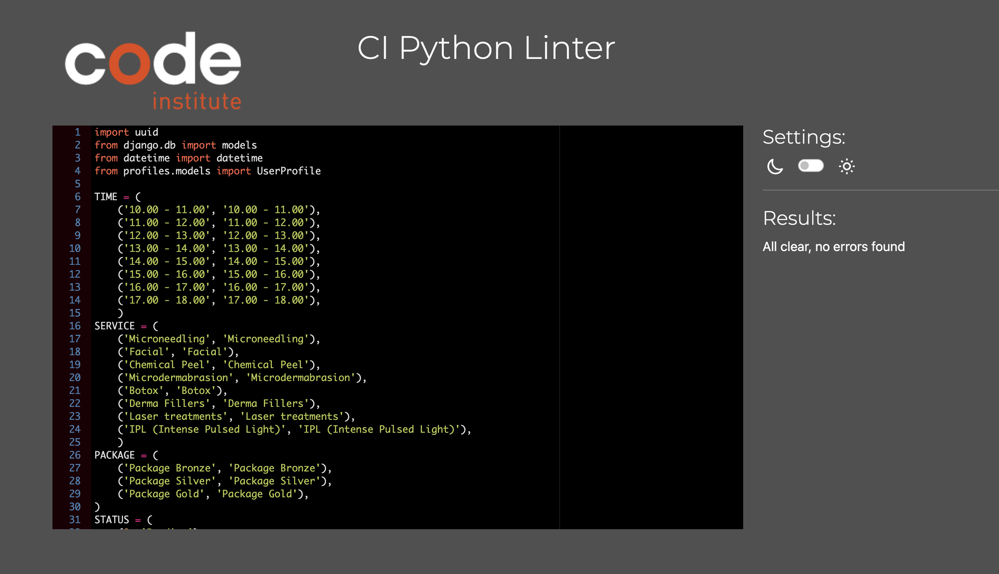

## Home Page:

## Services:

## Bookings:

## Profile:

## HTML Validator:

## CSS Validator:

## Lighthouse:

Manual Testing

<meta http-equiv="Content-Type" content="text/html; charset=utf-8">
<link type="text/css" rel="stylesheet" href="resources/sheet.css">

    <table class="waffle" cellspacing="0" cellpadding="0">
        <tbody>
            <tr style="height: 20px"><td class="s0" dir="ltr">Feature</td>
                <td class="s0" dir="ltr">Expected Outcome</td>
                <td class="s0" dir="ltr">Testing Performed</td>
                <td class="s0" dir="ltr">Result</td>
                <td class="s1" dir="ltr">Pass/Fail</td>
            </tr>
            <tr style="height: 20px"><td class="s2" dir="ltr">Navbar</td>
                <td class="s2"></td>
                <td class="s2"></td>
                <td class="s2"></td>
                <td class="s3"></td>
            </tr>
            <tr style="height: 20px"><td class="s2"></td>
                <td class="s2"></td>
                <td class="s2"></td>
                <td class="s2"></td>
                <td class="s3"></td>
            </tr>
            <tr style="height: 20px"><td class="s2" dir="ltr">Register Link (only shown if User not logged in)</td>
                <td class="s2" dir="ltr">When clicked the user will be redirected to the Register page.</td>
                <td class="s2" dir="ltr">Clicked link</td>
                <td class="s2" dir="ltr">Redirected to the register page.</td>
                <td class="s3" dir="ltr">Pass</td>
            </tr>
            <tr style="height: 20px"><td class="s2" dir="ltr">Login Link (only shown if User not logged in)</td>
                <td class="s2" dir="ltr">When clicked the user will be redirected to the Login page.</td>
                <td class="s2" dir="ltr">Clicked link</td>
                <td class="s2" dir="ltr">Redirected to the login page.</td>
                <td class="s3" dir="ltr">Pass</td>
            </tr>
            <tr style="height: 20px"><td class="s4" dir="ltr">Home Link / Logo</td>
                <td class="s2" dir="ltr">When clicked the user will be redirected to the home page.</td>
                <td class="s2" dir="ltr">Clicked link</td>
                <td class="s2" dir="ltr">Redirected to the home page</td>
                <td class="s3" dir="ltr">Pass</td>
            </tr>
            <tr style="height: 20px"><td class="s4" dir="ltr">Logout Link (Logged in users only)</td>
                <td class="s4" dir="ltr">When clicked the user will be redirected to the Logout page and a message
                    displayed to let the user know they will be logged out. On cliking Sing Out, they receive a success
                    message and are logged out.</td>
                <td class="s2" dir="ltr">Clicked link</td>
                <td class="s4" dir="ltr">Redirected to home page and alert message displayed to let me know I have been
                    logged out</td>
                <td class="s3" dir="ltr">Pass</td>
            </tr>
            <tr style="height: 20px"><td class="s4" dir="ltr"></td>
                <td class="s2"></td>
                <td class="s2"></td>
                <td class="s2"></td>
                <td class="s3"></td>
            </tr>
            <tr style="height: 20px"><td class="s4" dir="ltr">Footer</td>
                <td class="s2" dir="ltr"></td>
                <td class="s2" dir="ltr"></td>
                <td class="s2" dir="ltr"></td>
                <td class="s3" dir="ltr"></td>
            </tr>
            <tr style="height: 20px"><td class="s2" dir="ltr"></td>
                <td class="s2" dir="ltr"></td>
                <td class="s2" dir="ltr"></td>
                <td class="s2" dir="ltr"></td>
                <td class="s3" dir="ltr"></td>
            </tr>
            <tr style="height: 20px"><td class="s4" dir="ltr">Menu links</td>
                <td class="s4" dir="ltr">When clicked the user will be redirected to Services/Book Now/My Profile</td>
                <td class="s2" dir="ltr">Clicked link</td>
                <td class="s4" dir="ltr">When clicked the user will be redirected to Services/Book Now/My Profile</td>
                <td class="s3" dir="ltr"></td>
            </tr>
            <tr style="height: 20px"><td class="s2" dir="ltr">Facebook icon</td>
                <td class="s2" dir="ltr">When clicked the user will be redirected to Facebook on a new browser page.
                </td>
                <td class="s2" dir="ltr">Clicked icon</td>
                <td class="s2" dir="ltr">Redirected to Facebook on a new browser page.</td>
                <td class="s3" dir="ltr">Pass</td>
            </tr>
            <tr style="height: 20px"><td class="s2" dir="ltr">Instagram icon</td>
                <td class="s2" dir="ltr">When clicked the user will be redirected to Instagram on a new browser page.
                </td>
                <td class="s2" dir="ltr">Clicked icon</td>
                <td class="s2" dir="ltr">Redirected to Instagram on a new browser page.</td>
                <td class="s3" dir="ltr">Pass</td>
            </tr>
            <tr style="height: 20px">
                <td class="s4" dir="ltr">YouTube icon</td>
                <td class="s2" dir="ltr">When clicked the user will be redirected to Twitter on a new browser page.</td>
                <td class="s2" dir="ltr">Clicked icon</td>
                <td class="s4" dir="ltr">Redirected to YouTube on a new browser page.</td>
                <td class="s3" dir="ltr">Pass</td>
            </tr>
            <tr style="height: 20px">
                <td class="s2"></td>
                <td class="s2"></td>
                <td class="s2"></td>
                <td class="s2"></td>
                <td class="s3"></td>
            </tr>
            <tr style="height: 20px">
                <td class="s2" dir="ltr">Login Page</td>
                <td class="s2"></td>
                <td class="s2"></td>
                <td class="s2"></td>
                <td class="s3"></td>
            </tr>
            <tr style="height: 20px">
                <td class="s2"></td>
                <td class="s2"></td>
                <td class="s2"></td>
                <td class="s2"></td>
                <td class="s3"></td>
            </tr>
            <tr style="height: 20px">
                <td class="s4" dir="ltr">Register link</td>
                <td class="s2" dir="ltr">When clicked the user will be redirected to the register page.</td>
                <td class="s2" dir="ltr">Clicked link</td>
                <td class="s2" dir="ltr">Redirected to the register page</td>
                <td class="s3" dir="ltr">Pass</td>
            </tr>
            <tr style="height: 20px">
                <td class="s2" dir="ltr">Username input - empty</td>
                <td class="s2" dir="ltr">This is a required field so the form should not submit if empty</td>
                <td class="s2" dir="ltr">Tried to submit the form with this field empty</td>
                <td class="s2" dir="ltr">Tooltip tells me this field is required</td>
                <td class="s3" dir="ltr">Pass</td>
            </tr>
            <tr style="height: 20px">
                <td class="s2" dir="ltr">Password input empty</td>
                <td class="s2" dir="ltr">This is a required field so the form should not submit if empty</td>
                <td class="s2" dir="ltr">Tried to submit the form with this field empty</td>
                <td class="s2" dir="ltr">tooltip tells me this field is required</td>
                <td class="s3" dir="ltr">Pass</td>
            </tr>
            <tr style="height: 20px">
                <td class="s4" dir="ltr">Login button</td>
                <td class="s4" dir="ltr">Returns User to Home page Logout and My Profile option in Account. Alert
                    message shown welcoming the user and User Greeting visible in the navbar</td>
                <td class="s2" dir="ltr">Submitted form</td>
                <td class="s4" dir="ltr">Redirected to the Home page and alert message shown</td>
                <td class="s3" dir="ltr">Pass</td>
            </tr>
            <tr style="height: 20px">
                <td class="s2" dir="ltr">Incorrect username or password used</td>
                <td class="s4" dir="ltr">An alert message should display saying username/password incorrect - this is
                    defensive programming - not letting user know which input is incorrect</td>
                <td class="s2" dir="ltr">Incorrect username/password entered</td>
                <td class="s4" dir="ltr">Alert message to let the user know they have entered an incorrect
                    username/password</td>
                <td class="s3" dir="ltr">Pass</td>
            </tr>
            <tr style="height: 20px">
                <td class="s2"></td>
                <td class="s2"></td>
                <td class="s2"></td>
                <td class="s2"></td>
                <td class="s3"></td>
            </tr>
            <tr style="height: 20px">
                <td class="s2" dir="ltr">Register Page</td>
                <td class="s2"></td>
                <td class="s2"></td>
                <td class="s2"></td>
                <td class="s3"></td>
            </tr>
            <tr style="height: 20px">
                <td class="s2"></td>
                <td class="s2"></td>
                <td class="s2"></td>
                <td class="s2"></td>
                <td class="s3"></td>
            </tr>
            <tr style="height: 20px">
                <td class="s2" dir="ltr">Username input</td>
                <td class="s2" dir="ltr">Required field, user will be prompted if left blank</td>
                <td class="s2" dir="ltr">Left blank</td>
                <td class="s2" dir="ltr">tooltip lets the user know this is required field</td>
                <td class="s3" dir="ltr">Pass</td>
            </tr>
            <tr style="height: 20px">
                <td class="s2" dir="ltr">Username input - empty</td>
                <td class="s2" dir="ltr">The username is a required field, so should not submit with no value</td>
                <td class="s2" dir="ltr">Tried to submit form with no value entered</td>
                <td class="s2" dir="ltr">Tooltip lets user know this value is required</td>
                <td class="s3" dir="ltr">Pass</td>
            </tr>
            <tr style="height: 20px">
                <td class="s2" dir="ltr">Email input</td>
                <td class="s2" dir="ltr">The email input is not a required field, but if used must be an email address
                    format</td>
                <td class="s2" dir="ltr">Entered plain text</td>
                <td class="s2" dir="ltr">Tooltip tells user to use an email address here</td>
                <td class="s3" dir="ltr">Pass</td>
            </tr>
            <tr style="height: 20px">
                <td class="s2" dir="ltr">Password input</td>
                <td class="s2" dir="ltr">This field should be at least 8 characters long</td>
                <td class="s2" dir="ltr">Entered password less than 5 characters long</td>
                <td class="s2" dir="ltr">Tooltip tells user the password should be at least 8 characters long</td>
                <td class="s3" dir="ltr">Pass</td>
            </tr>
            <tr style="height: 20px">
                <td class="s2" dir="ltr">Password input - empty</td>
                <td class="s2" dir="ltr">The password is a required field, so should not submit with no value</td>
                <td class="s2" dir="ltr">Tried to submit form with no value entered</td>
                <td class="s2" dir="ltr">Tooltip lets user know this value is required</td>
                <td class="s3" dir="ltr">Pass</td>
            </tr>
            <tr style="height: 20px">
                <td class="s2" dir="ltr">Register button</td>
                <td class="s4" dir="ltr">Should redirect user to the Home page as a Registered and Logged in user, and a
                    successful alert message</td>
                <td class="s2" dir="ltr">Created new user and submitted form</td>
                <td class="s4" dir="ltr">Redirected to the home page and alert message shown</td>
                <td class="s3" dir="ltr">Pass</td>
            </tr>
            <tr style="height: 20px">
                <td class="s2"></td>
                <td class="s2"></td>
                <td class="s2"></td>
                <td class="s2"></td>
                <td class="s3"></td>
            </tr>
            <tr style="height: 20px">
                <td class="s4" dir="ltr">Services</td>
                <td class="s2"></td>
                <td class="s2"></td>
                <td class="s2"></td>
                <td class="s3"></td>
            </tr>
            <tr style="height: 20px">
                <td class="s2"></td>
                <td class="s2"></td>
                <td class="s2"></td>
                <td class="s2"></td>
                <td class="s3"></td>
            </tr>
            <tr style="height: 20px">
                <td class="s4" dir="ltr">Edit/Delete buttons visible if admin if authenticated</td>
                <td class="s4" dir="ltr">The Edit / Delete buttons show only for admin when authenticated</td>
                <td class="s2" dir="ltr">Visual test</td>
                <td class="s4" dir="ltr">Edit/Delete buttons visible if admin if authenticated</td>
                <td class="s3" dir="ltr">Pass</td>
            </tr>
            <tr style="height: 20px">
                <td class="s4" dir="ltr">Edit button</td>
                <td class="s4" dir="ltr">Edit button redirects admin to edit_service page</td>
                <td class="s2" dir="ltr">Clicked button</td>
                <td class="s4" dir="ltr">Edit button redirects admin to edit_service page</td>
                <td class="s3" dir="ltr">Pass</td>
            </tr>
            <tr style="height: 20px">
                <td class="s4" dir="ltr">Delete button</td>
                <td class="s4" dir="ltr">Delete button redirects admin to services page and deletes the service</td>
                <td class="s2" dir="ltr">Clicked button</td>
                <td class="s4" dir="ltr">Delete button redirects admin to services page and deletes the service</td>
                <td class="s3" dir="ltr">Pass</td>
            </tr>
            <tr style="height: 20px">
                <td class="s4" dir="ltr">When clicking on Services the services page renders</td>
                <td class="s4" dir="ltr">When the user clicks this link they should be taken to the services page</td>
                <td class="s2" dir="ltr">Clicked button</td>
                <td class="s4" dir="ltr">Redirected to services page</td>
                <td class="s3" dir="ltr">Pass</td>
            </tr>
            <tr style="height: 20px">
                <td class="s4" dir="ltr">Service detail page</td>
                <td class="s4" dir="ltr">When user clicks Read More button it is redirected to Service detail page</td>
                <td class="s2" dir="ltr">Clicked button</td>
                <td class="s4" dir="ltr">Service detail page renders for the correct service</td>
                <td class="s3" dir="ltr">Pass</td>
            </tr>
            <tr style="height: 20px">
                <td class="s4" dir="ltr">Data renders correctly</td>
                <td class="s4" dir="ltr">When service detail page renders, the data shown is correct and specific to the
                    product</td>
                <td class="s4" dir="ltr">Visual test</td>
                <td class="s4" dir="ltr">Data rendered is spesific to rendered product</td>
                <td class="s3" dir="ltr">Pass</td>
            </tr>
            <tr style="height: 20px">
                <td class="s4" dir="ltr">Toggle FAQ accordion</td>
                <td class="s4" dir="ltr">When clicked on FAQ questions the body of the accordion is expanding</td>
                <td class="s4" dir="ltr">Clicked header</td>
                <td class="s4" dir="ltr">When clicked on FAQ questions the body of the accordion is expanding</td>
                <td class="s3" dir="ltr">Pass</td>
            </tr>
            <tr style="height: 20px">
                <td class="s2"></td>
                <td class="s2"></td>
                <td class="s2"></td>
                <td class="s2"></td>
                <td class="s3"></td>
            </tr>
            <tr style="height: 20px">
                <td class="s4" dir="ltr">Booking Page</td>
                <td class="s2" dir="ltr"></td>
                <td class="s2" dir="ltr"></td>
                <td class="s2" dir="ltr"></td>
                <td class="s3" dir="ltr"></td>
            </tr>
            <tr style="height: 20px">
                <td class="s2" dir="ltr"></td>
                <td class="s2" dir="ltr"></td>
                <td class="s2" dir="ltr"></td>
                <td class="s2" dir="ltr"></td>
                <td class="s3" dir="ltr"></td>
            </tr>
            <tr style="height: 20px">
                <td class="s4" dir="ltr">Booking page renders</td>
                <td class="s4" dir="ltr">When link is clicked the page is rendering correctly </td>
                <td class="s2" dir="ltr">Clicked button</td>
                <td class="s4" dir="ltr">When link is clicked the page is rendering correctly </td>
                <td class="s3" dir="ltr">Pass</td>
            </tr>
            <tr style="height: 20px">
                <td class="s4" dir="ltr">Form data</td>
                <td class="s4" dir="ltr">If user is authenticated and has updated profile data forms should be prefilled
                </td>
                <td class="s4" dir="ltr">Visual test</td>
                <td class="s4" dir="ltr">Form is prefilled when user is authenticated with the users data</td>
                <td class="s3" dir="ltr">Pass</td>
            </tr>
            <tr style="height: 20px">
                <td class="s4" dir="ltr">Submit</td>
                <td class="s4" dir="ltr">On submit the form should save the data and redirect to susccess page</td>
                <td class="s2" dir="ltr">Clicked button</td>
                <td class="s4" dir="ltr">Redirected to success page and alert message received with booking number</td>
                <td class="s3" dir="ltr">Pass</td>
            </tr>
            <tr style="height: 20px">
                <td class="s4" dir="ltr">Submit form with past date</td>
                <td class="s4" dir="ltr">The form should raise an error and return the form</td>
                <td class="s2" dir="ltr">Clicked button</td>
                <td class="s4" dir="ltr">Error was raised in the form and the data wasn&#39;t saved</td>
                <td class="s3" dir="ltr">Pass</td>
            </tr>
            <tr style="height: 20px">
                <td class="s4" dir="ltr">Success page</td>
                <td class="s4" dir="ltr">When rendered it should show details of the booking (name, date, time, etc</td>
                <td class="s4" dir="ltr">Visual test</td>
                <td class="s4" dir="ltr">Success page renders with the correct data from the form submit</td>
                <td class="s3" dir="ltr">Pass</td>
            </tr>
            <tr style="height: 20px">
                <td class="s2"></td>
                <td class="s2"></td>
                <td class="s2"></td>
                <td class="s2"></td>
                <td class="s3"></td>
            </tr>
            <tr style="height: 20px">
                <td class="s4" dir="ltr">Booking Management</td>
                <td class="s2"></td>
                <td class="s2"></td>
                <td class="s2"></td>
                <td class="s3"></td>
            </tr>
            <tr style="height: 20px">
                <td class="s2"></td>
                <td class="s2"></td>
                <td class="s2"></td>
                <td class="s2"></td>
                <td class="s3"></td>
            </tr>
            <tr style="height: 20px">
                <td class="s4" dir="ltr">Page renders</td>
                <td class="s4" dir="ltr">When authenticated as admin, Booking Management Button should be visible and
                    when clicked to redirect admin to the page </td>
                <td class="s4" dir="ltr">Clicked link</td>
                <td class="s4" dir="ltr">Booking Management page renders correctly and table woth bookings data is
                    visible</td>
                <td class="s3" dir="ltr">Pass</td>
            </tr>
            <tr style="height: 20px">
                <td class="s4" dir="ltr">Bookings dates</td>
                <td class="s4" dir="ltr">In booking management page only future booking should be visible</td>
                <td class="s4" dir="ltr">Visual Test</td>
                <td class="s4" dir="ltr">Only future booking visible in the table and ordered by date</td>
                <td class="s3" dir="ltr">Pass</td>
            </tr>
            <tr style="height: 20px">
                <td class="s4" dir="ltr">Profile page</td>
                <td class="s4" dir="ltr">On rendering the oage should have a form with user data and booking history
                </td>
                <td class="s4" dir="ltr">Clicked Link</td>
                <td class="s4" dir="ltr">On loading the page has the form and the booking history</td>
                <td class="s3" dir="ltr">Pass</td>
            </tr>
            <tr style="height: 20px">
                <td class="s4" dir="ltr">Update Profile</td>
                <td class="s4" dir="ltr">When button is clicked information should be saved </td>
                <td class="s4" dir="ltr">Clicked Update button</td>
                <td class="s4" dir="ltr">Once clicked the information is saved and alert success message appears</td>
                <td class="s3" dir="ltr">Pass</td>
            </tr>
        </tbody>
    </table>

